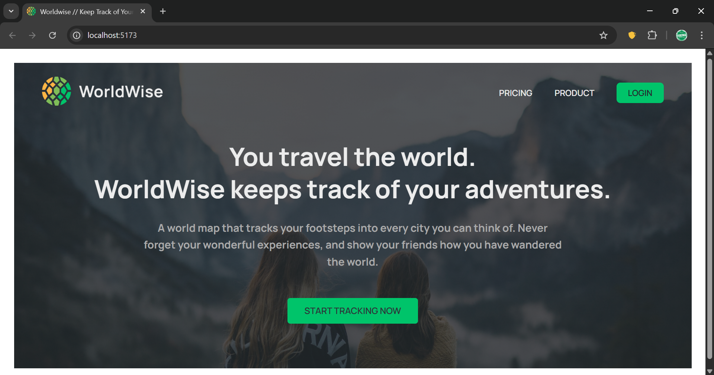
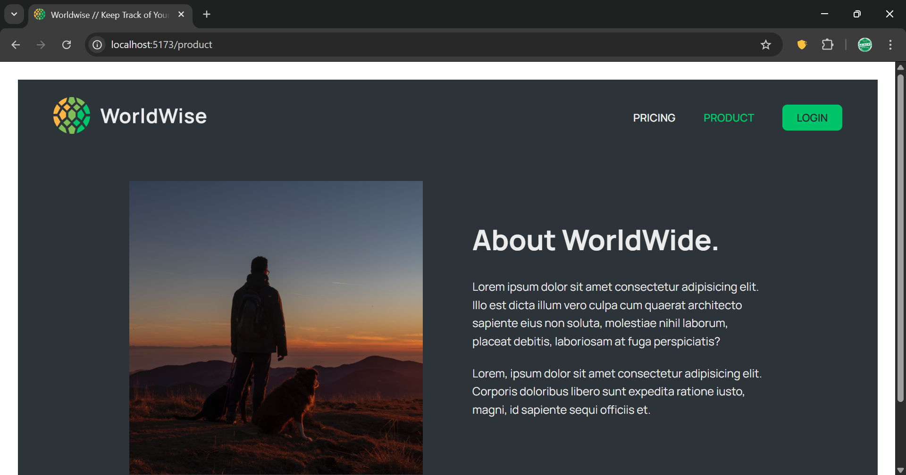
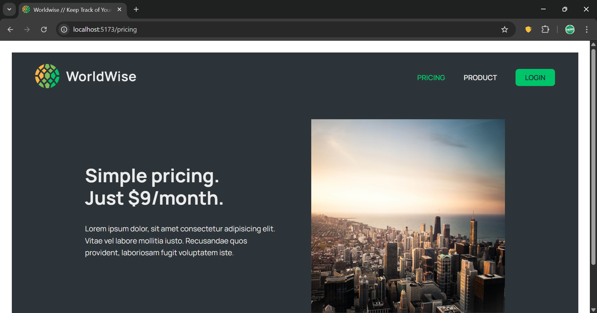
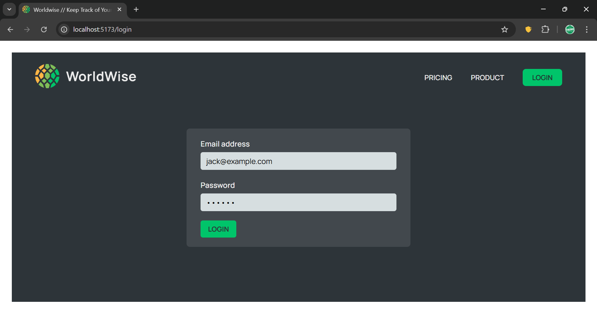
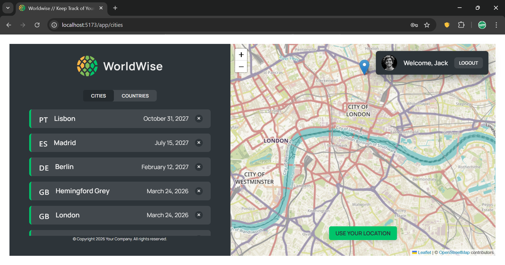
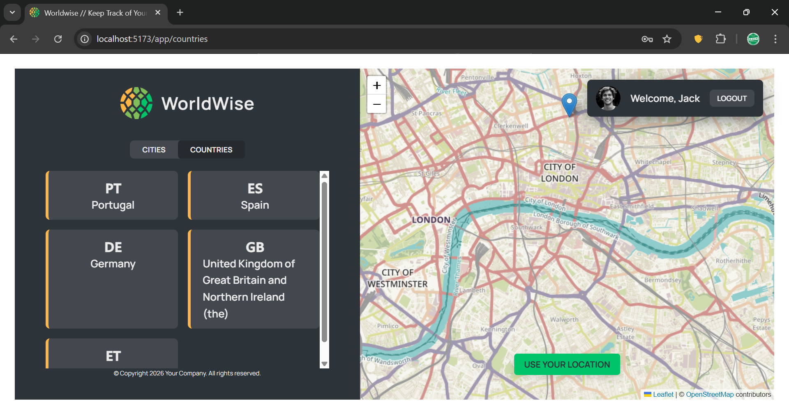
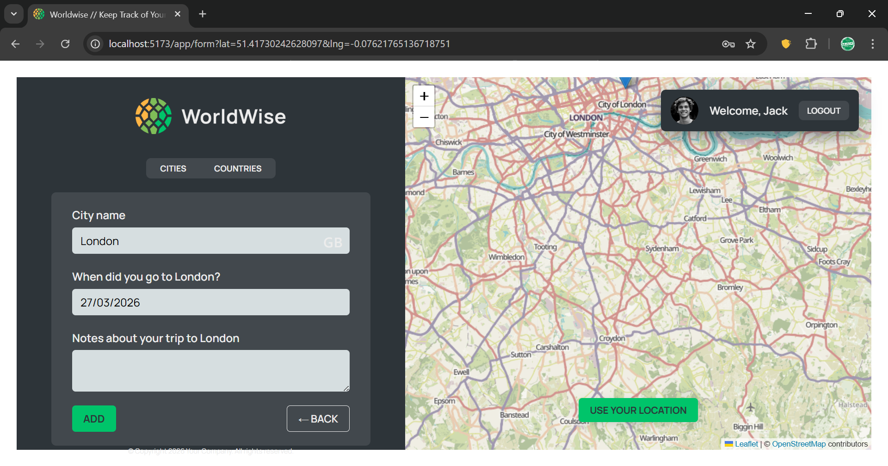
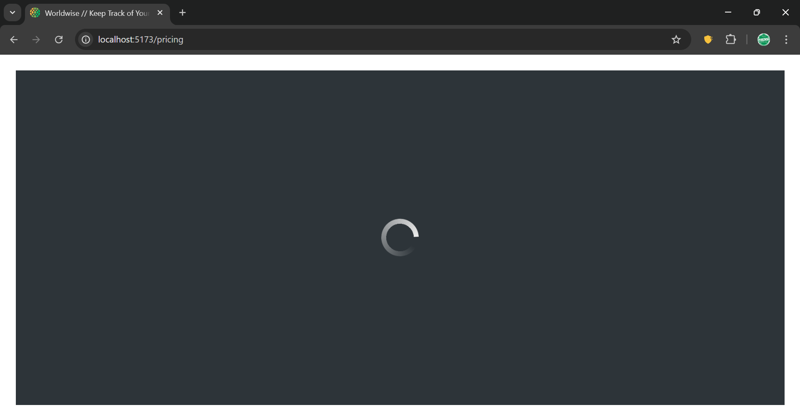

# WordWise

WordWise is a travel-tracking web app where users can mark cities they have visited on an interactive map, save trip notes, and browse their trips by city or country.

## What This App Does

- Authenticates users with a protected app area (mock auth flow)
- Displays an interactive map with saved city markers
- Lets users click any map location to add a new trip
- Auto-detects location details using reverse geocoding
- Stores and manages visited cities through a local JSON API
- Organizes saved trips by both city and country views

## Tech Stack

- React 19
- Vite 4
- React Router DOM 6
- React Leaflet + Leaflet (map rendering)
- JSON Server (local REST API)
- React Datepicker
- CSS Modules
- ESLint

## Key Features

- Route-level code splitting using `React.lazy` + `Suspense`
- Protected routes for `/app/*`
- Context API state management:
  - `CitiesContext` for city CRUD and loading/error states
  - `AuthContext` for login/logout and auth state
- Geolocation support with browser location access
- URL-based coordinate handling (`lat`, `lng`) for map-to-form flow
- Reverse geocoding via BigDataCloud API
- Responsive UI with reusable component architecture

## Project Structure

```text
wordwise/
├─ assets/                  # Project screenshots and static design assets
├─ public/                  # Public files served by Vite
├─ src/
│  ├─ components/           # Reusable UI and map-related components
│  ├─ context/              # Global app state (cities + auth)
│  ├─ data/                 # Local JSON data source for json-server
│  ├─ hooks/                # Custom hooks (geolocation, URL position)
│  ├─ pages/                # Route pages and layout containers
│  ├─ App.jsx               # Router setup and app composition
│  ├─ index.css             # Global styles
│  └─ main.jsx              # React app entry point
├─ index.html
├─ package.json
├─ vite.config.js
└─ README.md
```

## Screenshots

### Home



### Product



### Pricing



### Login



### App - Cities



### App - Countries



### Add City Form



### Full Page Loading



## Getting Started

### 1. Clone and install

```bash
git clone https://github.com/Afisphbl/wordwise.git
cd wordwise
npm install
```

### 2. Run the local API server

```bash
npm run server
```

This starts `json-server` at `http://localhost:9000` using `src/data/cities.json`.

### 3. Run the app

```bash
npm run dev
```

Open the app at the local Vite URL (usually `http://localhost:5173`).

## Available Scripts

- `npm run dev` - Start development server
- `npm run build` - Build for production
- `npm run preview` - Preview production build locally
- `npm run lint` - Run lint checks
- `npm run server` - Run local JSON API server on port `9000`

## Demo Login

Use the following credentials for the mock authentication flow:

- Email: `jack@example.com`
- Password: `qwerty`

## API and Data Notes

- Cities are fetched from and persisted to the local JSON server.
- New city creation uses map coordinates and date/notes from the form.
- Reverse geocoding is done with:
  - `https://api.bigdatacloud.net/data/reverse-geocode-client`

## Future Improvements

- Replace mock auth with real JWT/OAuth authentication
- Persist auth session in local storage/cookies
- Add edit/update flow for existing cities
- Add search, filter, and sort for city/country lists
- Add unit and integration tests (React Testing Library + Vitest)
- Add API error boundary and offline-friendly caching
- Add dark/light theme toggle and accessibility enhancements
- Deploy backend and frontend for a full hosted experience

## Author

**Afis**

- GitHub: [@Afisphbl](https://github.com/Afisphbl)

## License

This project is currently unlicensed. Add a `LICENSE` file if you want to define usage terms.
